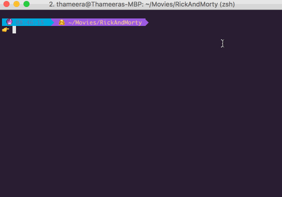

# vimv

vimv is a terminal-based file rename utility that lets you easily mass-rename files using Vim.

## Installing

```
curl https://raw.githubusercontent.com/thameera/vimv/master/vimv > ~/bin/vimv && chmod +755 ~/bin/vimv
```

Or simply copy the `vimv` file to a location in your `$PATH` and make it executable.

### Installing with Homebrew

Run the following.

```
brew install https://raw.githubusercontent.com/thameera/vimv/master/brew_formula/vimv.rb
````

## Usage

1. Go to a directory and enter `vimv` with optionally, a list of files to rename.
2. A Vim window will be opened with names of all files.
3. Use Vim's text editing features to edit the names of files. For example, search and replace a particular string, or use visual selection to delete a block.
4. Save and exit. Your files should be renamed now.

## Other features

* If you want to list only a group of files, you can pass them as an argument. eg: `vimv *.mp4`
* If you have an `$EDITOR` environment variable set, vimv will use its value by default.
* If you are inside a Git directory, vimv will use `git mv` (instead of `mv`) to rename the files.
* You can use `/some/path/filename` format to move the file elsewhere during renaming. If the path is non-existent, it will be automatically created before moving.

## Screencast



## Gotchas

Don't delete or swap the lines while in Vim or things will get ugly.

## Contributors
- Bhagya Silva (about.me/bhagyas)
